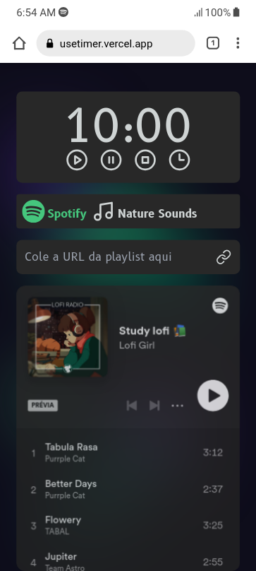

# useTimer
Enhance productivity with this Pomodoro timer app. Stay focused, manage time effectively, and enjoy music.

## Features

### Intuitive Controls

- Start and Pause: Initiate and pause the timer.
- Stop: Reset the timer to its initial value.
- Set Timer: Configure the timer duration using the Timer Modal.

### Real-time Display

- Countdown Display: Monitor the remaining time displayed in minutes and seconds.
- Automatic Reset: Timer resets to the initial value when it reaches zero.

### Customization Options

- Volume Control: Adjust the volume level of the nature sound player.
- Loop Functionality: Toggle the loop feature for continuous sound playback.
- Nature Sound Selection: Choose from a selection of nature sounds to accompany your work or relaxation.

### Player Selection

- Switch Player: Toggle between the Spotify player and the Nature Sound player for diverse audio experiences.

### Spotify Integration

- Spotify Playlist: Integrate your favorite Spotify playlist for a harmonious work or relaxation experience.

## Technologies
- React
- Next.js
- TypeScript
- Tailwind CSS
- React Tooltip
- React Icons
- Lucide React

## Getting Started
1. Clone this repository:
```bash

git@github.com:markoclimakodev/useTimer.git

```

2. Access the project folder
```

cd useTimer

```

3. Install the dependencies
```

npm install

```

4. Run the project
```

npm run dev

```
## Screenshots
<div style="display: flex; flex-direction: column; gap: 8px; justify-content: space-between;">
  <div style="display: flex; gap: 8px;">
    
    
  </div>
 <div style="flex: 1;">
    
  </div>

</div>

## Deployment

- [useTimer on Vercel](https://usetimer.vercel.app/)

## Contact

Feel free to connect with me on LinkedIn or email.

- LinkedIn: [markoclimako](https://www.linkedin.com/in/markoclimako/)
- Email: mkclimako@gmail.com
