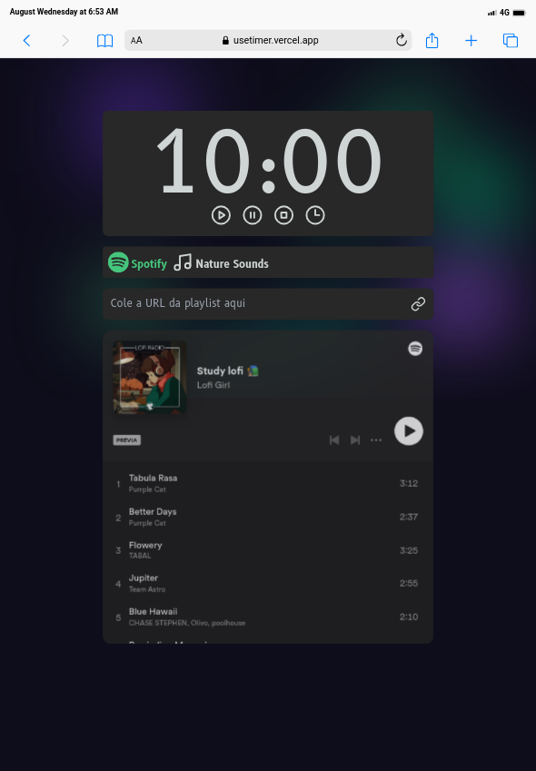
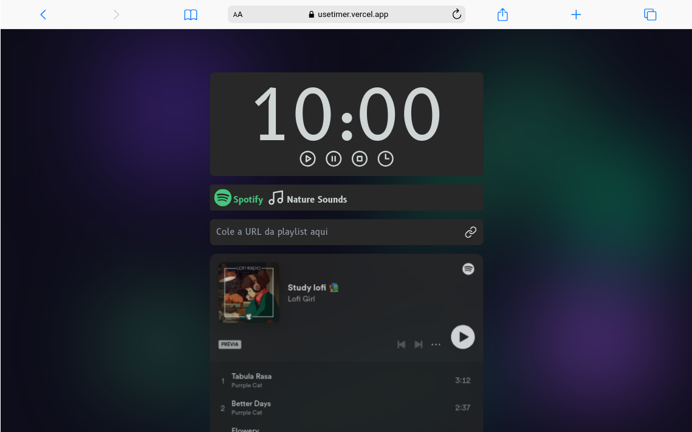

[Read in English](/README.md)

# useTimer
Aumente a produtividade com este aplicativo. Mantenha o foco, gerencie o tempo de forma eficaz e desfrute de suas músicas favoritas.

## Recursos

### Controles Intuitivos

- Iniciar e Pausar: Inicie e pause o cronômetro.
- Parar: Redefina o cronômetro para o valor inicial.
- Definir duração: Configure a duração do cronômetro.
- Redefinição Automática: O cronômetro é redefinido para o valor inicial quando chega a zero.

### Seleção de player

- Alternar Player: Alterne entre o player do Spotify e o player de Sons da Natureza para experiências de áudio diversificadas.

### Opções de Personalização

- Controle de Volume: Ajuste o nível de volume do player de sons da natureza.
- Funcionalidade de Repetição: Alterne a função de repetição para reprodução contínua de som.
- Seleção de Som da Natureza: Escolha entre uma seleção de sons da natureza para acompanhar seu trabalho ou relaxamento.


### Integração com o Spotify

- Lista de Reprodução do Spotify: Integre sua lista de reprodução favorita do Spotify para uma experiência de trabalho ou relaxamento harmoniosa.

> **Observação:** É necessário estar logado em sua conta do Spotify por meio de um navegador web para ouvir as faixas completas, em vez das prévias.

Siga estas etapas para garantir a melhor experiência:

1. Abra o navegador web de sua preferência e visite o site oficial do Spotify.
2. Faça login em sua conta do Spotify ou crie uma nova conta, se necessário.
3. Depois de estar logado, retorne ao nosso aplicativo.

## Tecnologias
- React
- Next.js
- TypeScript
- Tailwind CSS
- React Tooltip
- React Icons
- Lucide React

## Primeiros Passos
1. Clone este repositório:
```bash
git@github.com:markoclimakodev/useTimer.git
```
2. Acesse a pasta do projeto
```bash
cd useTimer
```
3. Instale as dependências
```bash
npm install
```
4. Execute o projeto
```bash
npm run dev
```
## Screenshots
<div style="display: flex; flex-direction: column; gap: 8px; justify-content: space-between;">
  <div style="display: flex; gap: 8px;">
    
    
  </div>
 <div style="flex: 1;">
    
  </div>

</div>

## Deploy

- [useTimer na Vercel](https://usetimer.vercel.app/)

## Contato

Sinta-se à vontade para se conectar comigo no LinkedIn ou por e-mail.

- LinkedIn: [markoclimako](https://www.linkedin.com/in/markoclimako/)
- Email: mkclimako@gmail.com